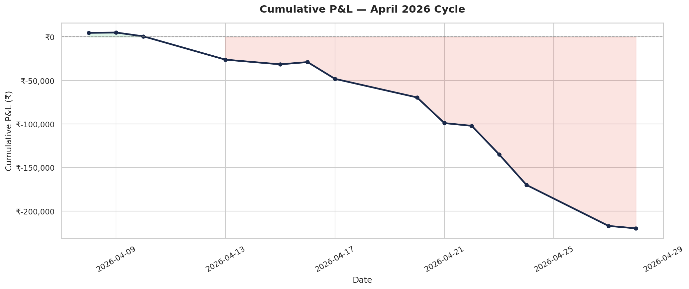
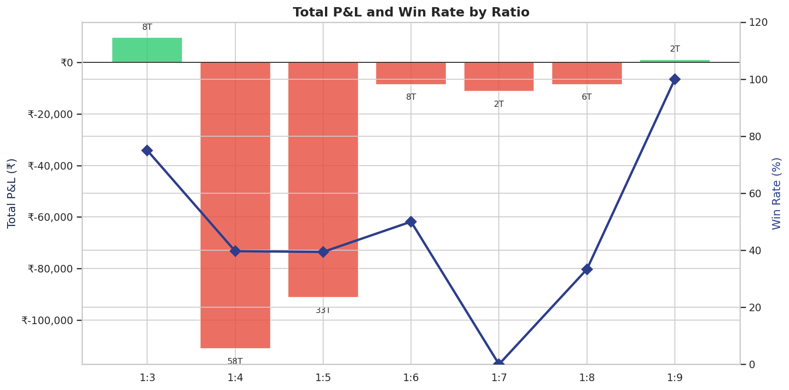
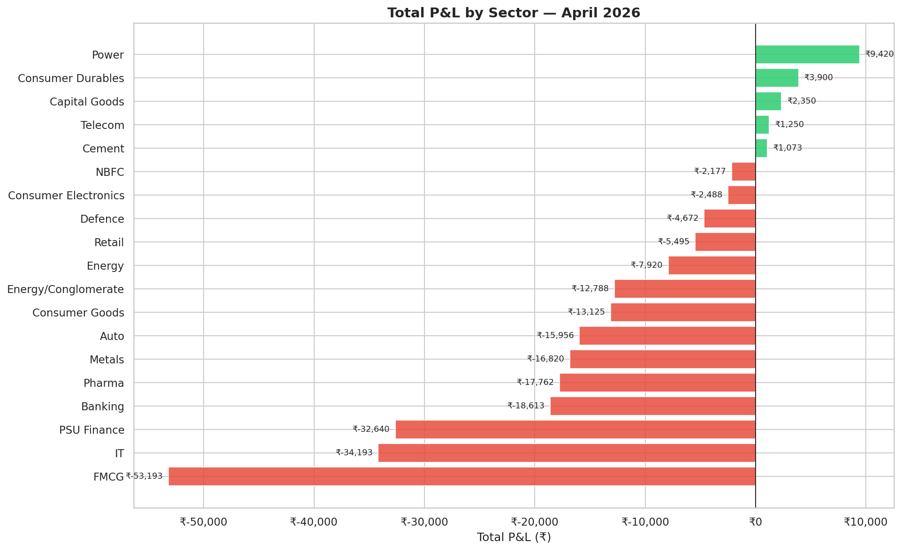
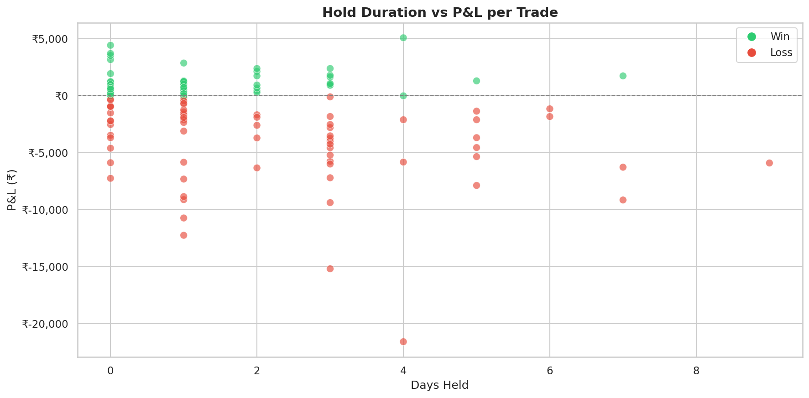
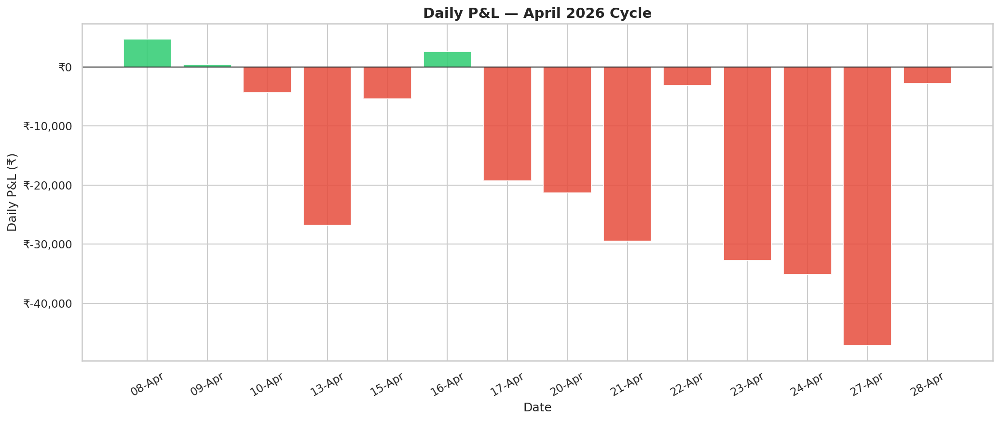
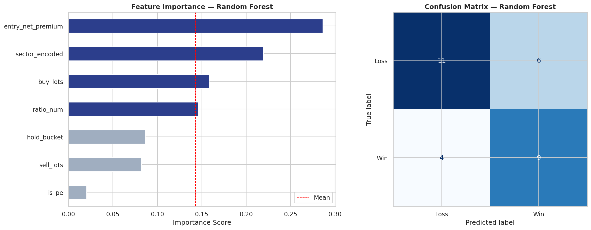
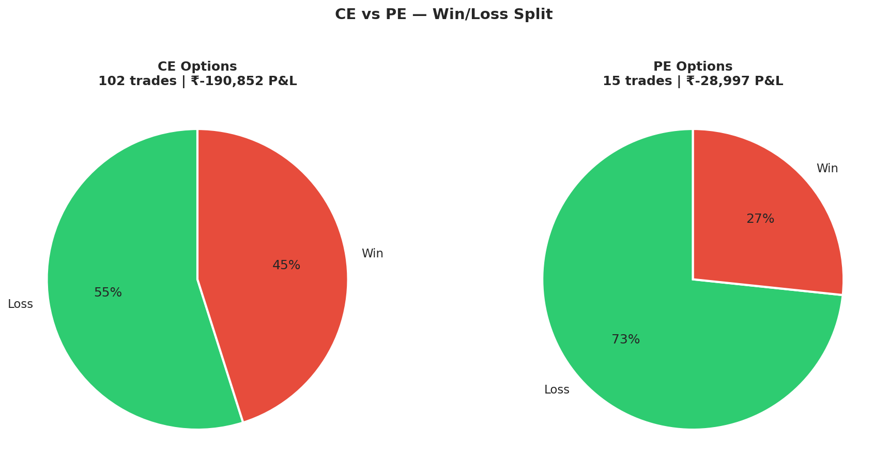

# 🇮🇳 NSE Options Intelligence
### End-to-End Trading Analytics | April 2026 | Business Analytics Portfolio

---

## Project Overview
Analysed **117 live NSE stock options trades** executed over a 3-week cycle  
(April 7–28, 2026) with ₹70 lakh working capital.

**Strategy:** Short ratio spreads on Nifty 50 individual stocks  
**Stocks traded:** SBIN, Reliance, TCS, HUL, Maruti, HDFC Bank + 30 others  
**Sectors covered:** 19 sectors across the Indian market

---

## Tech Stack
| Layer | Tool | Purpose |
|---|---|---|
| Database | PostgreSQL (Supabase) | Schema design, storage, analytical queries |
| Analysis | Python · Pandas · Matplotlib · Seaborn | EDA and visualisation |
| ML | Scikit-learn · Random Forest | Win/Loss prediction |
| Reporting | Excel · openpyxl | KPI dashboard |

---

## Key Findings

- 117 trades · 36 stocks · 19 sectors · ₹70L working capital
- 42.7% win rate · Avg win ₹1,221 · Avg loss ₹4,192 · R/R ratio 0.29x
- **1:3 ratio** is the only profitable strategy — 75% win rate, ₹9,651 profit
- **1:4 ratio** — most used (58 trades) but worst performer — ₹1,11,142 loss
- **FMCG sector** drove the largest loss — ₹53,193 across 19 trades
- **Power, Consumer Durables, Capital Goods** — 100% win rate sectors
- **PE options** win rate only 27% vs CE at 45% — avoid PE trades
- **ML model** identifies `entry_net_premium` and `sector` as top predictors of outcome

---

## SQL Highlights · PostgreSQL on Supabase

Window functions · CTEs · Aggregations · Ranking

```sql
-- Cumulative P&L using window function
SELECT exit_date,
       SUM(pnl_inr)                                    AS daily_pnl,
       SUM(SUM(pnl_inr)) OVER (ORDER BY exit_date)     AS cumulative_pnl
FROM trades
GROUP BY exit_date
ORDER BY exit_date;
```

---

## Charts

### Cumulative P&L — April 2026


### P&L and Win Rate by Ratio


### Sector Performance


### Hold Duration vs P&L


### Daily P&L


### ML — Feature Importance and Confusion Matrix


### CE vs PE Breakdown


---

## Repository Structure

```
nse-options-intelligence/
├── README.md
├── trades_april2026.csv
├── nse_options_intelligence_schema.sql
├── chart1_cumulative_pnl.png
├── chart2_ratio_analysis.png
├── chart3_sector_pnl.png
├── chart4_hold_vs_pnl.png
├── chart5_daily_pnl.png
├── chart6_ml_results.png
├── chart7_ce_vs_pe.png
└── nse_options_intelligence.ipynb
```

---

## About

Personal project built to document and analyse a live NSE options trading cycle.  
Demonstrates: database design · data cleaning · EDA · feature engineering  
· ML classification · business KPI design on real financial data.

*Business Analytics Masters Portfolio — Germany 2026*
